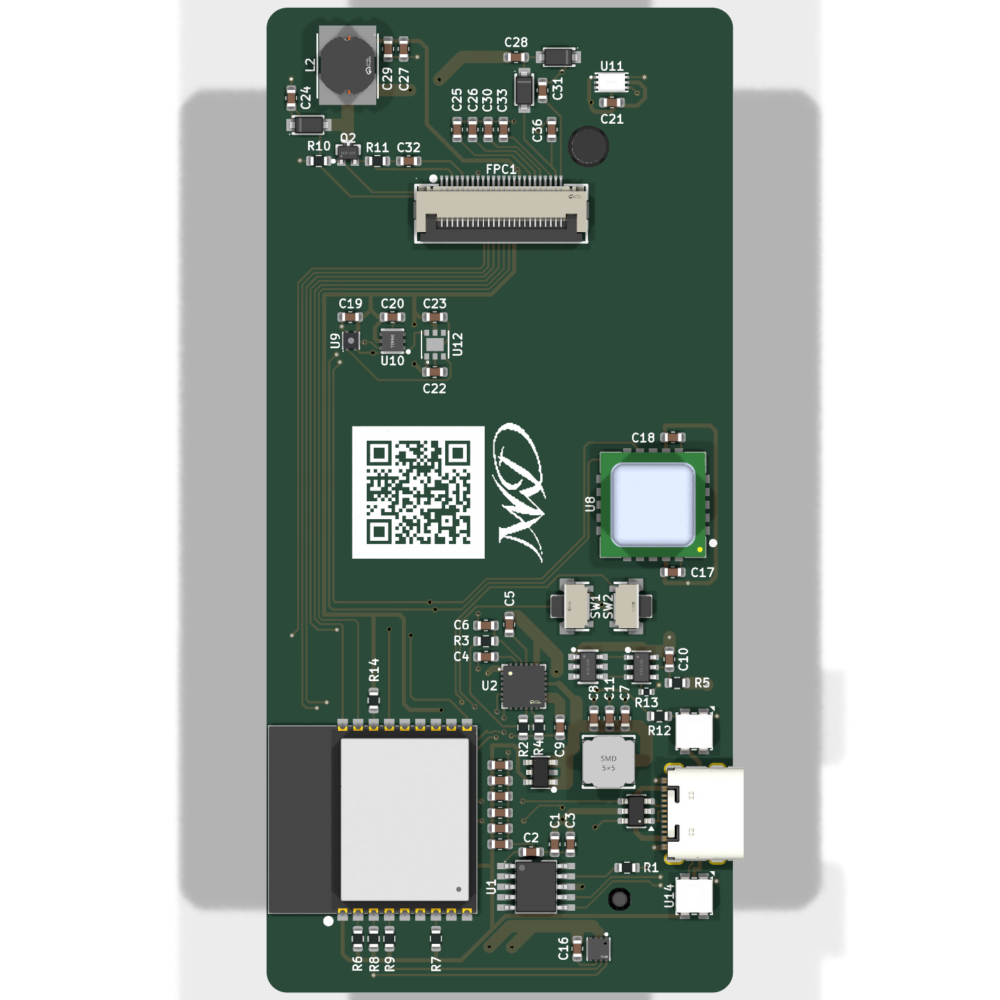
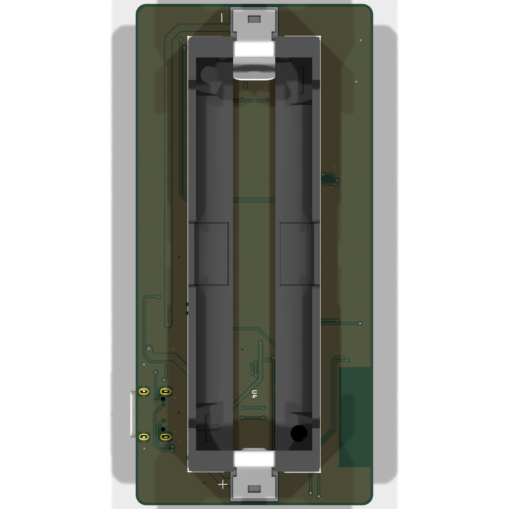
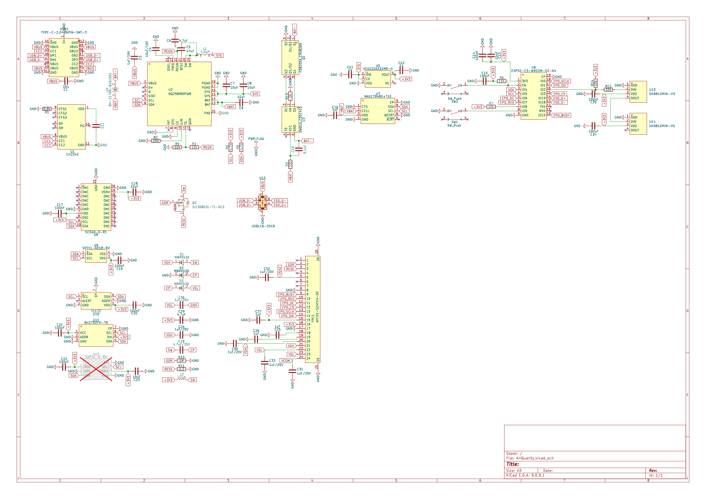

# AirQuality

A battery-powered indoor air quality monitor. Real CO₂ from a photoacoustic
sensor, VOC and NOx, temperature, humidity and ambient light, shown on a 2.13"
e-paper display and sent over Bluetooth LE.

Two layers, 45 × 95 mm, 76 electrical components, one 21700 lithium cell.

| front | back |
|---|---|
|  |  |

---

## 1. What it measures

| Sensor | Measures | Accuracy | I²C |
|---|---|---|---|
| **SCD40** | CO₂, photoacoustic, a real measurement rather than an estimate | ±(50 ppm + 5 % of reading) | `0x62` |
| **SGP41** | VOC and NOx index | index, not a concentration | `0x59` |
| **SHT41** | humidity and temperature | ±1.8 %RH, ±0.2 °C | `0x44` |
| **T117Z** | temperature, the precision channel | ±0.1 °C, 16 bit | `0x48` |
| **BH1750** | ambient light | 1 lx resolution, 1–65535 lx | `0x23` |
| **MAX17048** | state of charge of the cell | ±1 %, no shunt needed | `0x36` |
| **BQ25895** | charger status and control | - | `0x6A` |

Everything shares one I²C bus. The addresses do not collide.

The SCD40 is the only sensor that measures CO₂ directly. The SGP41 reports a
VOC and a NOx index derived from a heated metal-oxide cell. That reads as "the
air is getting stale", and is not comparable to a ppm figure.



The full schematic as a PDF is in [`docs/schematic.pdf`](docs/schematic.pdf).

---

## 2. How the power works

```text
   USB-C ──▶ CH224K ──▶ VBUS ──▶ BQ25895 ──▶ SYS ──▶ XC6222 ──▶ 3.3 V
             requests            charger            LDO         MCU, sensors,
             9 V over PD                                        display
                                    │
                                    ▼
                                  21700 cell
                                    │
                              DW01A + FS8205A
                              cell protection
```

The **CH224K** negotiates 9 V over USB Power Delivery. At 9 V the charger draws
about half the current it would at 5 V for the same charging power. Less loss
in the cable, less heat. A 6.8 kΩ resistor on CFG1 selects the voltage; the
value comes straight from the table in the CH224K datasheet.

The **BQ25895** is a switching charger, not a linear one. It can deliver up to
5 A; the input current limit is set by a 250 Ω resistor to about 2.1 A. It also
provides the power path, so the device runs from USB while charging.

The cell is a **Molicel INR21700-P45B**, which ships unprotected. **DW01A** with
an **FS8205A** dual MOSFET adds over-charge, over-discharge and over-current
protection. A 1 kΩ resistor sits between the DW01A's VM pin and the pack
negative, as the datasheet's application circuit requires. Without it, plugging
in a charger while the protection has tripped puts the full charger voltage on
that pin with nothing to limit the current.

The **XC6222** drops SYS to 3.3 V. Its CE pin is tied to SYS: the regulator is
always on while the cell has charge. It cannot be switched off from the ESP32,
because the ESP32 hangs on that same rail and could never switch it back on.

---

## 3. The display

A 2.13" e-paper panel (GDEY0213B74, SSD1680 controller) on a 24-pin 0.5 mm FPC
connector. Bistable: it holds the image with no power at all, and only draws
current while updating.

The panel needs gate and source rails well beyond 3.3 V. They are generated on
the board, following the reference circuit in the panel's datasheet:

- a boost converter produces **VGH**: a 47 µH inductor and an SI1308 MOSFET,
  driven by the panel's own GDR output with a 2.2 Ω sense resistor on RESE
- a charge pump off the same switching node produces the negative **VGL**
- the other rails (VSH1, VSH2, VSL, VCOM) come from the panel's internal
  regulators and only need decoupling

All seven capacitors on these rails are rated **25 V**. That is not decoration:
VGH runs above 20 V, and a standard 1 µF 0603 from the shelf is often a 6.3 or
16 V part.

**BS1 is tied low**, which selects 4-wire SPI, matching the SDA/SCL/CS/DC/RES
wiring used here.

**Update budget.** The panel is rated for one million updates *or* five years,
whichever comes first. At one update per minute the update budget is gone in
under two years; at three minutes and longer, the five-year limit is reached
first. Redrawing no more often than every three minutes, and only when a value
actually changes, keeps the panel inside both limits.

---

## 4. Board details

| | |
|---|---|
| Size | 45 × 95 mm |
| Layers | 2, 35 µm copper |
| Ground | pour on the back, 3306 mm² |
| Minimum clearance | 0.2 mm |
| Minimum track | 0.2 mm |
| Vias | 0.6 mm pad, 0.3 mm drill |

**The ESP32 antenna** sits at the board edge with a keep-out on both copper
layers. Nothing is routed through it: no track, no via, no pour.

**ESD protection** on the USB data lines: a USBLC6-2SC6 sits 1.9 mm from the
connector pads, with the signal routed *through* the device rather than
branched off it, and a ground via right at its ground pad. Both matter more
than they look: an ESD pulse rises in under a nanosecond, and every millimetre
of track between the connector and the clamp adds roughly 35 V of overshoot
that the ESP32 then sees.

**U12 (SGP41) is marked do-not-populate.** The footprint and routing are there;
the part is left off in the current build. Fitting it later needs no board
change.

---

## 5. Building one

Everything needed is in this repository.

**Boards.** [`production/AirQuality-gerber.zip`](production/) goes straight to a
fab house. Two layers, 1.6 mm, 35 µm copper, any standard process. The zip holds
the Gerbers and the Excellon drill files.

**Parts.** [`production/AirQuality-bom.csv`](production/) lists every component
with its LCSC number where one exists.
[`production/AirQuality-positions.csv`](production/) is the pick-and-place file.

**Datasheets** for every active part are in [`datasheets/`](datasheets/), named
by LCSC part number.

**Opening the design.** KiCad 9. Open
[`hardware/AirQuality.kicad_pro`](hardware/). All symbols, footprints and 3D
models live in `hardware/libraries/` and are referenced relatively, so the
project opens from any location.

**Mechanical.** [`docs/AirQuality.step`](docs/) is the full board with all
components, for enclosure design.

---

## 6. Design notes

Longer notes on why things are the way they are:

- [`docs/design-notes.md`](docs/design-notes.md): component choices and the
  reasoning behind them
- [`docs/track-widths.md`](docs/track-widths.md): current, trace widths and
  the IPC-2221 arithmetic

---

## 7. Verification

The board passes with no electrical findings:

```text
   ERC                      0 errors, 0 warnings
   Unconnected pads         0
   Shorts                   0
   Clearance violations     0
   Schematic parity         0
```

Every integrated circuit has been checked pin by pin against its datasheet. Not
against memory or a symbol's label, but against the document in
[`datasheets/`](datasheets/).

Remaining DRC output is silkscreen only: reference designators over copper and
part outlines crossing the board edge at the connectors. Neither affects
manufacture.

---

## 8. License

[PolyForm Noncommercial 1.0.0](LICENSE). Any use is permitted except a
commercial one.
